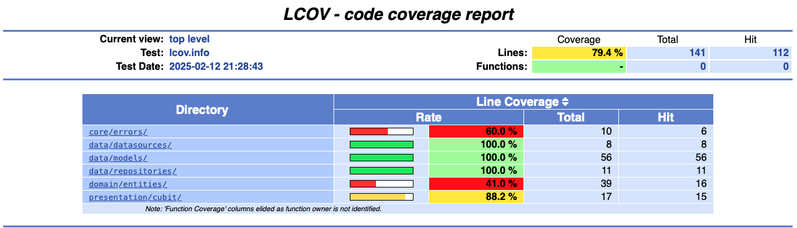

# Guia de Motéis GO - Flutter

## 📌 Descrição do Projeto

Este projeto é um **teste para Desenvolvedor Mobile (Flutter)** no segmento de motéis. O objetivo é criar uma **réplica da tela de listagem de motéis** (apenas a aba "Ir Agora") do aplicativo Guia de Motéis GO, consumindo uma API mock para exibir os dados.

## Demonstração do aplicativo:


**[Link](https://drive.google.com/file/d/1zRjYnvNqOuxsSGoK_Ac_DgrAWJB7O1rt/view?usp=share_link) para o video da demonstração.**


## 🚀 Tecnologias Utilizadas

- **Flutter** e **Dart**
- **Gerenciamento de Estado:** Bloc (Cubit)
- **Consumo de API:** Dio
- **Testes Unitários:** Flutter Test
- **Versionamento:** GitHub

## 📡 APIs Utilizadas

Os dados dos motéis foram obtidos a partir do seguinte endpoint:

- [https://www.npoint.io/docs/e728bb91e0cd56cc0711](https://www.npoint.io/docs/e728bb91e0cd56cc0711)

O endpoint abaixo, fornecido, está com um problema de certificado, não foi possível utilizar. O certificado deve ser atualizado:

- [https://jsonkeeper.com/b/1IXK](https://jsonkeeper.com/b/1IXK)

## 📌 Funcionalidades Implementadas

✅ Listagem de motéis com **nome, preço e imagem**\
✅ Consumo de API utilizando **Dio**\
✅ Gerenciamento de estado com **Bloc (Cubit)**\
✅ Estrutura modularizada seguindo boas práticas\
✅ Testes unitários cobrindo os principais componentes\
✅ Interface responsiva e amigável ao usuário

## 🏗 Estrutura do Projeto

```
/lib
├── core
│   ├── constants
│   ├── errors
│   │   ├── exceptions.dart
│   │   └── failure.dart
│   ├── network
│   ├── utils
│   │   └── typedef.dart
│   └── widgets
├── data
│   ├── datasources
│   │   └── motel_remote_data_source.dart
│   ├── models
│   │   ├── categoria_item_model.dart
│   │   ├── desconto_model.dart
│   │   ├── item_model.dart
│   │   ├── motel_model.dart
│   │   ├── periodo_model.dart
│   │   └── suite_model.dart
│   ├── repositories
│   │   └── motel_repository_impl.dart
│   └── services
├── presentation
│   ├── cubit
│   │   ├── motel_cubit.dart
│   │   └── motel_state.dart
│   ├── views
│   │   └── motel_list_view.dart
│   └── widgets
│       ├── image_card.dart
│       ├── items_card.dart
│       ├── motel_card.dart
│       ├── period_card.dart
│       └── suite_card.dart
└── main.dart

/test
├── cubit
│   ├── motel_cubit_test.dart
├── data
│   ├── datasources
│   │   └── motel_remote_data_source_test.dart
│   ├── models
│   │   ├── categoria_item_model_test.dart
│   │   ├── desconto_model_test.dart
│   │   ├── item_model_test.dart
│   │   ├── motel_model_test.dart
│   │   ├── periodo_model_test.dart
│   │   └── suite_model_test.dart
│   ├── repositories
│   │   └── motel_repository_impl_test.dart
└── presentation
    └── cubit
        └── motel_cubit_test.dart
```

## 🛠 Como Executar o Projeto

### **1️⃣ Clone o repositório**

```bash
git clone https://github.com/seu-usuario/seu-repositorio.git
cd seu-repositorio
```

### **2️⃣ Instale as dependências**

```bash
flutter pub get
```

### **3️⃣ Execute o projeto**

```bash
flutter run
```

## ✅ Testes

Para rodar os testes unitários:

```bash
flutter test
```

## 📊 Cobertura de Testes



## 📜 Licença

Este projeto é de uso exclusivo para fins de avaliação.

---
**Desenvolvido por **[**João Vitor Pires Dias**](https://github.com/joaovitorpd)**.**